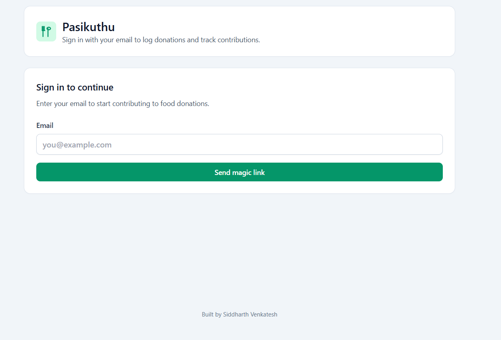

# Pasikuthu – An Wave For Food Donations

Modern React + TypeScript + Vite app for coordinating community food donations.
Volunteers authenticate with a magic link, log donations, chat with donors
over WhatsApp, and adjust remaining portions in real time.

https://pasikuthu.vercel.app/



## Features

- 🔐 Passwordless email OTP (magic-link) authentication via Supabase
- 📝 Donation entry form with name, location, contact and quantity tracking
- 🗂️ Live feed of donations with optimistic updates
- 🔄 Manual “Update quantity” action for donors once items are picked up
- 💬 One-tap WhatsApp chat links for every contact number
- 🎨 Tailwind CSS styling + responsive layout

## Tech Stack

| Layer      | Tech                                                       |
| ---------- | ---------------------------------------------------------- |
| Frontend   | React 19, TypeScript, Vite 5                               |
| Styling    | Tailwind CSS 3                                             |
| Backend    | Supabase Auth + Postgres (hosted)                          |
| Toolkit    | ESLint, TypeScript strict mode, npm scripts                |

## Getting Started

### 1. Clone & install

```bash
git clone https://github.com/<you>/pasikuthu-donations.git
cd pasikuthu-donations
npm install
```

### 2. Environment variables

Create a `.env` (or `.env.local`) in the project root:

```
VITE_SUPABASE_URL=https://<your-project>.supabase.co
VITE_SUPABASE_ANON_KEY=your-anon-public-key
```

### 3. Supabase table & policies

Run the SQL below in **Supabase Dashboard → SQL editor**:

```sql
CREATE TABLE IF NOT EXISTS public.donations (
  id UUID DEFAULT gen_random_uuid() PRIMARY KEY,
  created_at TIMESTAMPTZ NOT NULL DEFAULT timezone('utc', now()),
  food_name TEXT NOT NULL,
  description TEXT,
  qty INTEGER NOT NULL CHECK (qty > 0),
  name TEXT,
  location TEXT,
  contact_number TEXT
);

ALTER TABLE public.donations ENABLE ROW LEVEL SECURITY;

CREATE POLICY "Allow authenticated insert" ON public.donations
  FOR INSERT TO authenticated WITH CHECK (true);

CREATE POLICY "Allow authenticated select" ON public.donations
  FOR SELECT TO authenticated USING (true);
```

### 4. Customize the magic-link email

Supabase Dashboard → Authentication → **Email Templates** → _Magic Link_.

Subject:
```
Your Pasikuthu Donation Link
```

Body:
```
This link contains the donation food link. Please contribute how much ever you can.

Click this link to start contributing to food donations:
{{ .ConfirmationURL }}

Thank you for your contribution!
```

### 5. Start the app

```bash
npm run dev
```

Visit https://pasikuthu.vercel.app/ and log in with your email. Supabase will email you
the magic link.

## Scripts

| Command        | Description                            |
| -------------- | -------------------------------------- |
| `npm run dev`  | Start Vite dev server with HMR         |
| `npm run build`| Type-check + production build          |
| `npm run preview` | Preview build locally               |
| `npm run lint` | ESLint across the project              |

## WhatsApp Deep Links

Contact numbers are normalized to digits and prefixed with `https://wa.me/` for
instant messaging. Store phone numbers as 10-digit strings (without +91); the UI
validates this and prepends the country code on send.

## Folder Overview

```
src/
  App.tsx            # Main UI + auth + donation logic
  lib/supabaseClient.ts
  index.css          # Tailwind entry
public/
  fork-spoon.svg     # Custom favicon/icon
```

## Roadmap Ideas

- Inline quantity editor (no prompt)
- Donation filters (location, food type)
- CSV / Google Sheets export
- Real-time subscription to donation changes

## License

MIT © Siddharth Venkatesh. Customize freely for your community food drives.***
